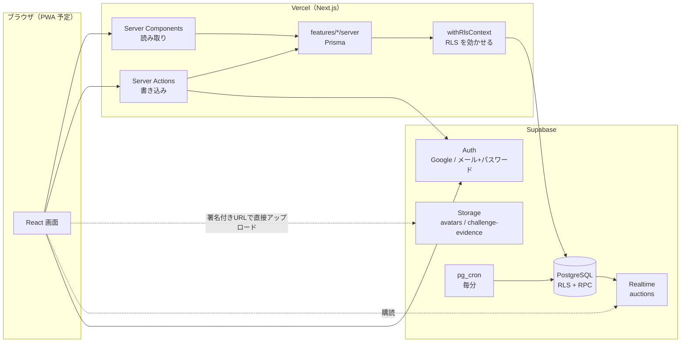
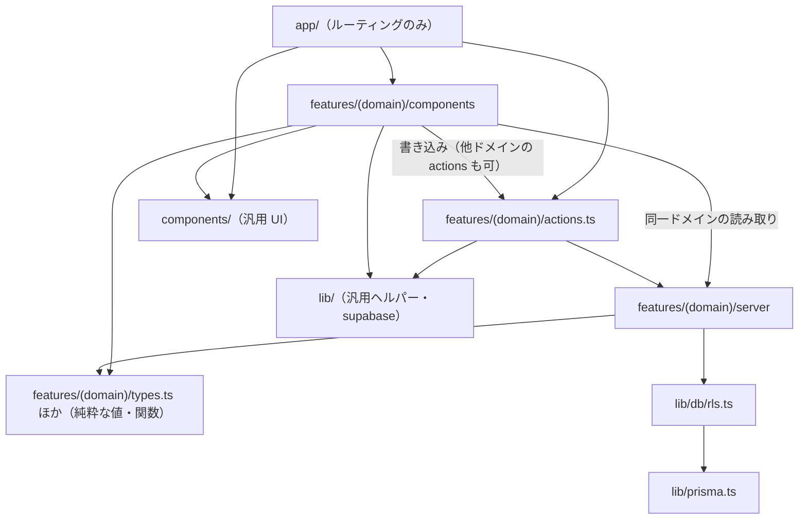
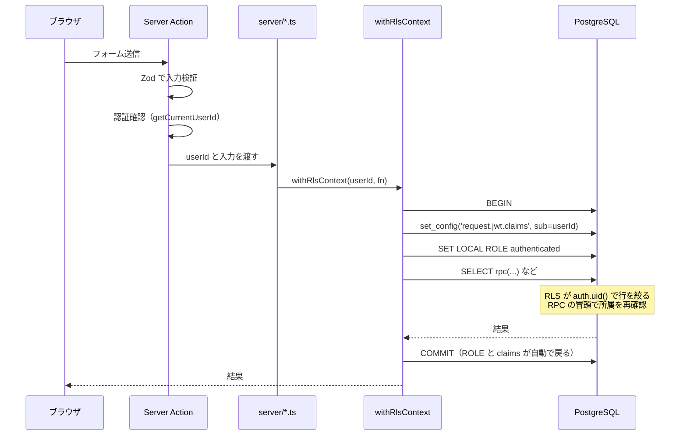
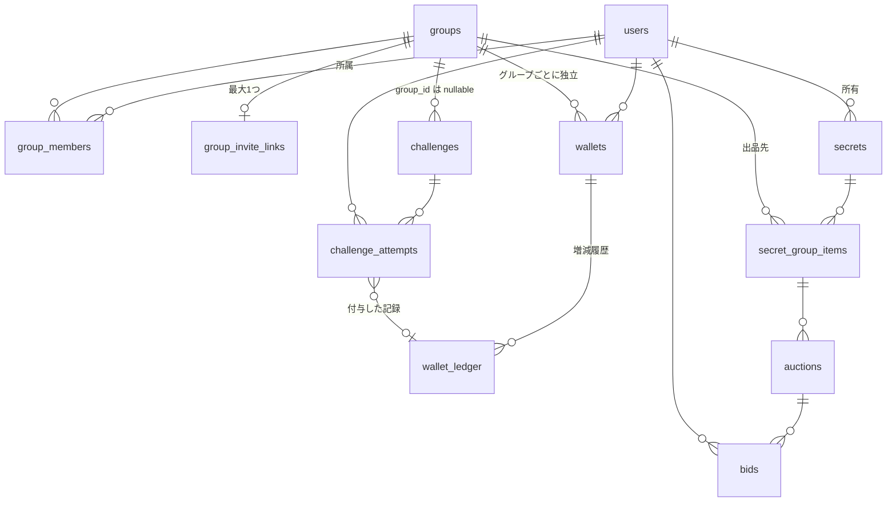
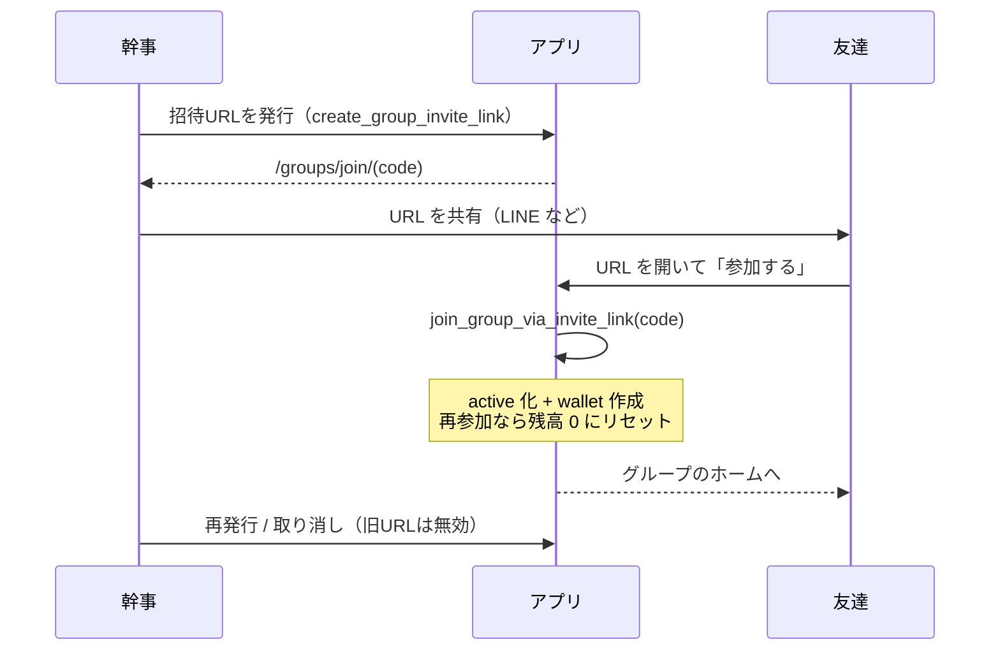
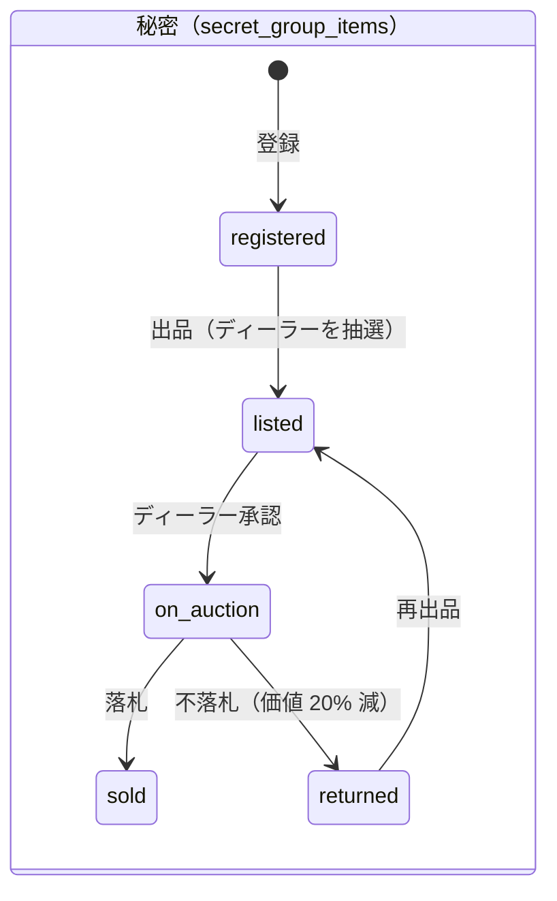
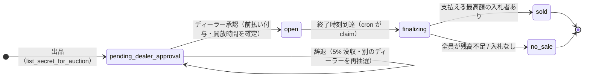
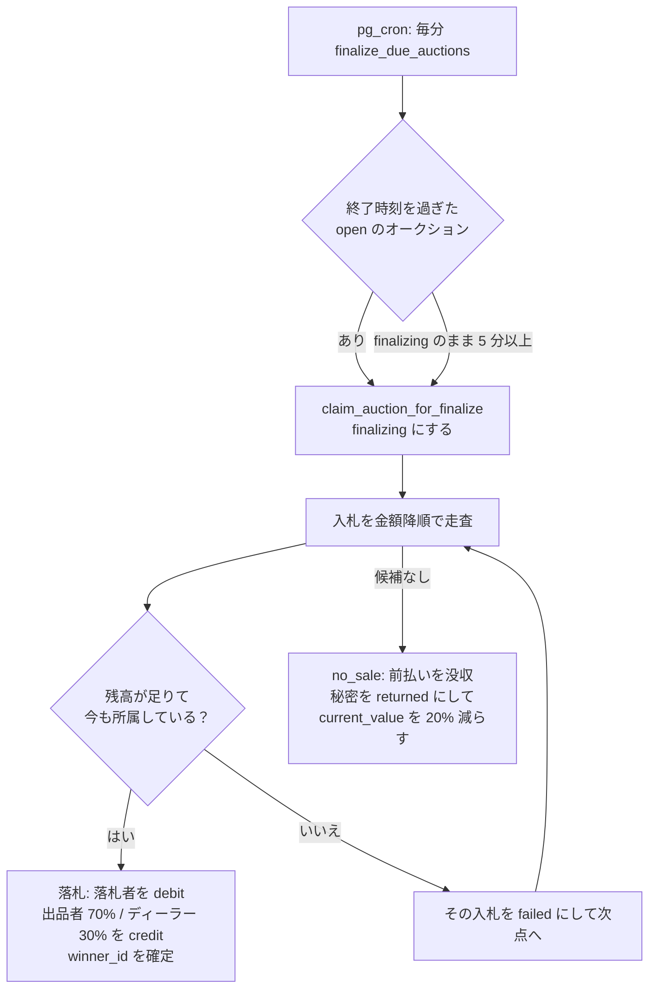
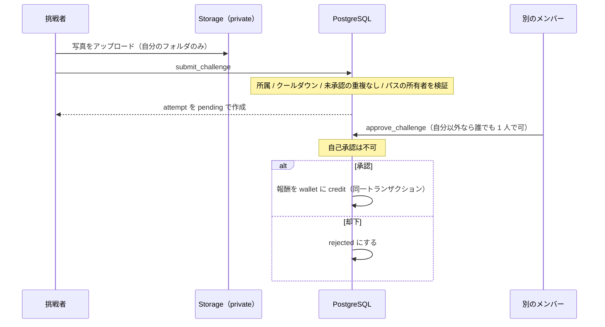

# 実装状況

2026-09-30 時点の実装を、文章・図・表でまとめたもの。仕様の正は [`README.md`](./README.md) の優先順位に従う。**この文書はコード（`prisma/` `features/` `app/`）から読み取った現状の記録**で、仕様を決めるものではない。

## 1. 全体像

友達グループ向けの「秘密オークション」PWA（仮）。Next.js（App Router）が画面とサーバー処理を持ち、データ・認証・リアルタイムは Supabase に置く。ビジネスロジックの中心は PostgreSQL Function（RPC）。

| レイヤー | 技術 | 置き場所 |
| --- | --- | --- |
| 画面 | React 19 / Next.js 16（App Router）/ Tailwind 4 / RHF / Zod | `app/` `features/*/components/` `components/` |
| 書き込み入口 | Server Actions（入力検証 + 認証確認） | `features/*/actions.ts` |
| DB アクセス | Prisma（`withRlsContext` 経由のみ） | `features/*/server/` `lib/db/rls.ts` |
| ビジネスロジック | PostgreSQL Function（`SECURITY DEFINER`） | `prisma/sql/<domain>/` |
| アクセス制御 | RLS + 関数内チェック | `prisma/sql/<domain>/001_rls.sql` ほか |
| 認証・保存・購読 | Supabase Auth / Storage / Realtime | `lib/supabase/` |
| 定期処理 | `pg_cron`（毎分、落札確定） | `prisma/sql/auctions/007_finalize_cron.sql` |
| ホスティング | Vercel（リージョン hnd1） | `vercel.json` |
| CI | GitHub Actions（lint / typecheck / build） | `.github/workflows/ci.yml` |

## 2. コードの層と依存の向き

`app/` は薄く（9〜71 行）、画面の中身は `features/<domain>/components/` にある。依存の向きは ESLint（`eslint-plugin-boundaries`）で強制していて、`npm run lint` で検査される。

| 禁止事項 | 検出方法 |
| --- | --- |
| `features/*/server` の外から Prisma を import | ESLint（`no-restricted-imports`） |
| `components` から他ドメインの `server/` `components/` を import | ESLint（`boundaries/dependencies`） |
| Supabase Client でテーブルを直接読み書き | ESLint |
| `components` から Storage 操作 | ESLint |
| 読み取り専用の `server/` を書き込みに使う | コードレビュー（機械では検出できない） |

## 3. リクエストの流れとグループ分離

**「グループ完全分離」が最大の不変条件**（他グループのデータ漏れは致命傷）。RLS と関数内チェックの二重で守る。

| 防御 | 内容 |
| --- | --- |
| 1. RLS | 全テーブルで所属メンバーのみ参照可。wallet・入札などは直接の書き込みポリシー自体を定義しない |
| 2. RPC 内チェック | `is_group_member` / `is_group_admin` で冒頭に所属・権限を確認。`SECURITY DEFINER` で `search_path` を固定 |
| 3. 書き込みは RPC のみ | 残高・入札・落札・ポイント付与はクライアントから直接更新できない |
| 4. 検証 | `npm run verify:rls`（ほかドメインごとの `verify:*`）で実 DB を確認 |

## 4. ドメイン別の実装状況

| ドメイン | 画面 | RPC（`prisma/sql/`） | 検証スクリプト | 状態 |
| --- | --- | --- | --- | --- |
| auth | ログイン、サインアップ、オンボーディング、アカウント設定 | `create_profile` | `verify:auth` `verify:storage` | 実装済み（Google ログイン失敗時のエラー表示は未実装 #140） |
| groups | グループ一覧・切替、作成、ホーム、管理、招待URLでの参加 | `create_group` `create_group_invite_link` `revoke_group_invite_link` `join_group_via_invite_link` `leave_group` `kick_group_member` `update_group_member_role` | `verify:groups` `verify:rls` | 実装済み。**グループ名・開放時間の変更と削除は画面がモックで RPC 未実装（#138）** |
| secrets | 秘密リスト（3 サブタブ）、登録シート、詳細、コレクション | `register_secret` `update_secret_before_listing` `delete_secret_before_listing` `list_secret_for_auction` | `verify:secrets` | 実装済み |
| auctions | 一覧、会場（入札）、ディーラー承認・辞退 | `approve_dealer_assignment` `decline_dealer` `place_bid` `claim_auction_for_finalize` `finalize_auction` `finalize_due_auctions` | `verify:auctions` `verify:auction` | 実装済み |
| challenges | 一覧、承認待ち、詳細、写真提出、作成（幹事） | `submit_challenge` `approve_challenge` `create_group_challenge` | `verify:challenges` | 実装済み。システム共通チャレンジの中身と獲得上限は未実装 |
| wallet | 残高表示、履歴 | `_credit_wallet` `_debit_wallet`（内部）`get_dealer_decline_history` | `verify:wallet` | 実装済み（読み取り専用） |
| users | プロフィール、アカウント設定の画面 | （`auth` の RPC を利用） | — | 実装済み（一部の操作はモック） |

## 5. 画面（ルート）

| ルート | 画面 | 備考 |
| --- | --- | --- |
| `/` `/login` `/signup` | ログイン・サインアップ・オンボーディング | |
| `/auth/callback` | OAuth のコールバック（route handler） | |
| `/settings` | アカウント設定 | |
| `/groups` | グループ一覧・切替（所属ゼロなら空状態） | |
| `/groups/new` | グループ作成 | |
| `/groups/join/[code]` | 招待URLでの参加 | |
| `/groups/[groupId]` | ホーム | |
| `/groups/[groupId]/manage` | グループ管理（幹事） | 招待URL発行は実装済み、設定はモック |
| `/groups/[groupId]/secrets` `/[secretId]` | 秘密リスト（自分の秘密 / ディーラー担当 / コレクション）、関連秘密詳細 | 登録はボトムシート |
| `/groups/[groupId]/collection/[secretId]` | 落札した秘密の閲覧 | |
| `/groups/[groupId]/auctions` `/[auctionId]` | オークション一覧、会場 | Realtime で価格更新 |
| `/groups/[groupId]/challenges` | チャレンジ一覧 / 承認待ち（`?tab=review`） | |
| `/groups/[groupId]/challenges/[challengeId]` `/submit` | 詳細、写真提出 | |
| `/groups/[groupId]/challenges/new` | チャレンジ作成（幹事） | |
| `/groups/[groupId]/me` | マイページ（グループ別ポイント・履歴） | |

## 6. データモデル

実質 12 テーブル。定義は `prisma/schema.prisma`、設計の根拠は [`DB.md`](./DB.md)。

| テーブル | 役割 | 要点 |
| --- | --- | --- |
| `users` | プロフィール | `auth.users` と 1:1（FK なし） |
| `groups` | グループ | `auction_open_seconds`（既定 24 時間）だけがグループごとの設定 |
| `group_members` | 所属・権限 | 状態は `active` / `left` / `kicked`（`invited` は使わない） |
| `group_invite_links` | 招待URL | `group_id` が PK。再発行で旧リンクは自動失効 |
| `wallets` | グループごとの残高 | マイナス残高あり。脱退で失効 |
| `wallet_ledger` | 増減履歴 | 直接書き込み不可。RPC 内の内部関数だけが書く |
| `secrets` | 秘密の本体 | タイトル / 概要（ディーラー限定）/ 本文 / カテゴリ / レア度 |
| `secret_group_items` | グループ内での扱い | 出品状態と価格を持つ |
| `auctions` | 競り | `winner_id` が閲覧権の正本 |
| `bids` | 入札 | エスクローなし |
| `challenges` | チャレンジ定義 | `group_id` が null なら共通チャレンジ |
| `challenge_attempts` | 挑戦履歴 | 承認情報（`reviewed_*`）を含む |

**View（情報の見え方を制御）**: `auction_public_view`（一覧・会場） / `auction_dealer_summary_view`（ディーラーだけが概要を読める） / `bidder_identified_view`（出品者・ディーラーは入札者が分かる） / `anonymous_bid_feed_view`（それ以外は匿名） / `my_secret_collection_view`（落札した秘密の本文）

**ポイントの増減の種類（`wallet_tx_kind`）**

| 種類 | 発生する場面 |
| --- | --- |
| `challenge_reward` | チャレンジの承認 |
| `listing_prepay` | ディーラー承認時に出品者へ前払い（出品価格の 100%） |
| `listing_reclaim` | 不落札時に前払いを没収 |
| `winning_bid_debit` | 落札者から落札額を引く |
| `seller_share_credit` / `dealer_share_credit` | 落札額を出品者 70% / ディーラー 30% で按分 |
| `dealer_decline_fee` | ディーラー辞退料（出品価格の 5%、完全没収） |
| `admin_adjustment` | 定義のみ（MVP では使わない） |

## 7. 主要フロー

### 7.1 招待と参加（URL 方式）

### 7.2 秘密から落札まで

| ステップ | RPC | 主なガード |
| --- | --- | --- |
| 登録 | `register_secret` | 所属確認。本文は落札前に本人以外に見せない |
| 出品 | `list_secret_for_auction` | 出品者以外からランダムにディーラーを選ぶ。前払いは**まだ払わない** |
| 承認 | `approve_dealer_assignment` | ディーラー本人のみ。ここで前払いを付与し、開始・終了時刻を確定 |
| 辞退 | `decline_dealer` | 承認前のみ。出品価格の 5% を没収 |
| 入札 | `place_bid` | 自出品・ディーラーは不可、残高内、現在価格超え |
| 確定 | `claim_auction_for_finalize` → `finalize_auction` | 入札額の降順で残高が足りる人を探す（次点繰り上げ）。二重確定を防ぐ 2 段階 |

### 7.3 チャレンジ（写真提出 → 承認 → ポイント付与）

## 8. 認証・保存・リアルタイム・定期処理

| 項目 | 実装 |
| --- | --- |
| 認証方式 | Google OAuth、メールアドレス + パスワード。セッションは `proxy.ts` でリフレッシュ |
| 認可 | RLS + RPC 内の所属・権限チェック。幹事（admin）だけが招待・キック・権限変更・チャレンジ作成 |
| Storage: `avatars` | public。5MB、png/jpeg/webp。追加のみ（変更は新しいパスへ） |
| Storage: `challenge-evidence` | private。本人と、その提出を参照する同グループのメンバーだけが読める |
| Realtime | `auctions` のみ（会場の現在価格・状態）。RLS がそのまま配信にも効く |
| 定期処理 | `pg_cron` が毎分 `finalize_due_auctions` を実行 |
| 検証 | `scripts/verify-*.mts` 10 本（実 DB を使う結合検証）。単体テストは未導入 |

## 9. 未実装と今後

| 項目 | 状況 | Issue |
| --- | --- | --- |
| グループ名・開放時間の変更、グループ削除 | 画面はモック、RPC 未実装 | #138 |
| PWA（manifest / service worker / インストール案内） | 未着手 | #137 |
| Google ログイン失敗時のエラー表示 | 未実装 | #140 |
| `verify-rls.mts` の修正 | 削除済みの関数を呼んでいる | #152 |
| テスト基盤（Vitest）と単体テスト | 未導入 | #146 |
| CI 強化（テスト・DB 検証） | lint / typecheck / build のみ | #147 |
| 監視（エラー・性能・落札確定ジョブ） | 未導入 | #148 |
| E2E（Playwright）・RLS テスト（pgTAP） | 未導入 | #149 |
| ローカル開発環境のコンテナ化 | 未着手 | #150 |
| インフラのコード化（Terraform） | 未着手 | #151 |
| システム共通チャレンジの中身、獲得上限 | 未定 / 未実装 | — |
| Realtime の対象拡大、Web Push、複数グループへの秘密公開、AI validation | Phase 2 | — |
