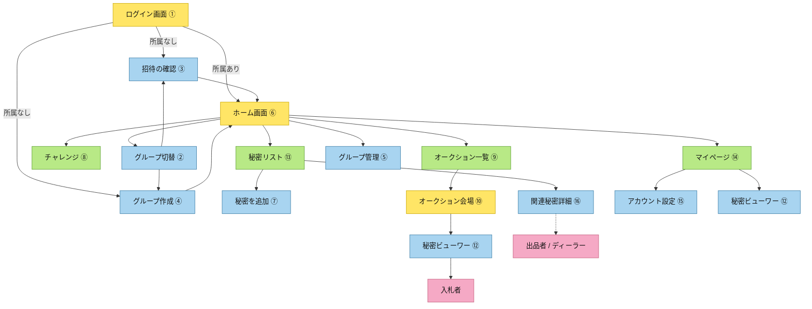

# 画面

作成者: 扇間純平  
作成日時: 2026年7月29日 16:40  
最終更新者: Cursor Agent（画面構成合意の反映）  
最終更新日時: 2026年8月14日

関連: [`PRD.md`](./PRD.md) / [`オークションルール.md`](./オークションルール.md) / [`ユーザーフロー .md`](./ユーザーフロー%20.md) / [`画面遷移図.md`](./画面遷移図.md)

> **ショップ（⑪）は廃止。** 秘密の獲得はオークションのみ。  
> ポイントは**選択中グループの財布のみ**（グループ横断合算なし）。

---

## 1. 常設ナビ（グループ選択後）— 5タブ

| タブ | 遷移先 | 備考 |
| --- | --- | --- |
| ホーム | ⑥ | |
| 秘密リスト | ⑬ | 自分の秘密リスト（ステータス・出品・ディーラー） |
| チャレンジ | ⑧ | ミニゲーム/チャレンジ |
| オークション | ⑨ | グループ内の競り一覧 |
| マイページ | ⑭ | |

---

## 2. 画面遷移（確定分のみ・付箋ツリー）

`docs/オークションルール.jpg` 右図と同じ書き方。色は層の区別用（デザイン指定ではない）。

- 黄: 入口・ハブ / 会場系
- 緑: 一覧（常設タブ）
- 青: 詳細・操作
- ⑪ショップは無し

```text
ログイン画面 ①
    │
    ├──（所属なし）→ 招待の確認 ③ ──┐
    │                                 ├──→ ホーム画面 ⑥
    └──（所属なし）→ グループ作成 ④ ──┘
    │
    └──（所属あり）→ ホーム画面 ⑥
            │
            ├── 秘密リスト ⑬（タブ）
            │       ├── 秘密を追加する画面 ⑦
            │       └── 関連秘密詳細 ⑯（自分に関係する秘密：出品 / ディーラー担当 等）
            │
            ├── チャレンジ ⑧（タブ）
            │
            ├── オークション一覧 ⑨（タブ）
            │       └── オークション会場 ⑩（入札）
            │               └── 秘密ビューワー ⑫（落札後）
            │
            └── マイページ ⑭（タブ）
                    ├── アカウント設定 ⑮
                    └── 秘密ビューワー ⑫（コレクション）
```

ホームからの付帯（タブ外・確定）:

```text
ホーム ⑥
    ├── グループ切替 ②
    │       ├── 招待の確認 ③（追加参加）
    │       └── グループ作成 ④
    └── グループ管理 ⑤（幹事）
```

⑩ / ⑯ / ⑫ の役割:

```text
⑬ → ⑯ 関連秘密詳細 … 出品者 / ディーラー
⑨ → ⑩ オークション会場 → ⑫ 秘密ビューワー
                                    └── 入札者（落札後はここ）
```



---

## 3. 画面一覧

### 3.1 認証・グループ管理系

| 画面 | 主な中身 |
| --- | --- |
| **① オンボーディング・ログイン** | アカウント作成、ニックネーム・アイコン。PWA のホーム画面追加案内（技術選定） |
| **② グループ切り替え** | 所属一覧（アイコン・未読・**そのグループのポイント**）、タップで切替 |
| **③ 招待の確認**（旧グループ参加） | 自分宛の招待一覧（`invited`状態）を表示し、承諾/辞退。2026-08-17変更: 招待コード/QR方式は廃止。`DB.md` §4.3・§6.1 参照 |
| **④ グループ作成** | 名・アイコンのみ（招待コード/リンク発行は廃止） |
| **⑤ グループ管理（幹事）** | メンバー管理（ニックネーム検索→招待。§6.1 `search_users`/`invite_member`）、オークション開催時間（`auction_open_seconds`）。~~ショップ価格~~廃止 |

### 3.2 メイン（選択中グループに紐づく）

| 画面 | 主な中身 |
| --- | --- |
| **⑥ ホーム** | グループ名＋切替導線、保有ポイント、開催中オークションのハイライト、お知らせ |
| **⑦ 秘密登録** | カテゴリ・レア度（自己申告）・本文、公開タイミング。公開先複数選択は **MVP 外**（PRD）。登録後は⑬に載る |
| **⑧ チャレンジ** | 一覧・提出/承認・履歴・クールダウン（**提供コンテンツは未定**。機能枠のみ） |
| **⑨ オークション一覧** | カード（カテゴリ・レア度・現在価格・残り時間）、ソート/フィルター。開催待ち/競り中の出し分けは UI 詳細で詰める |
| **⑩ オークション会場** | **⑨から。** 入札用。現在価格、カウントダウン、入札ボタン、入札履歴（他入札者は識別不可）。自出品への入札不可。残高不足なら入札不可。ウォッチリストは Phase 2 候補可 |
| **⑪ ショップ** | **廃止（実装しない）** |
| **⑫ 秘密ビューワー** | 落札した秘密の本文（リアクション/コメントは DB-7 確定により MVP 対象外） |
| **⑬ 自分の秘密リスト** | 下記 §4 |
| **⑯ 関連秘密詳細** | **⑬から。** 自分に関係する秘密の状況（出品者 / ディーラー担当）。出品者は入札者を識別可。ディーラーは概要のみ・入札不可。本文は見られない |

### 3.3 横断・個人系

| 画面 | 主な中身 |
| --- | --- |
| **⑭ マイページ** | グループ別ポイント・履歴、コレクション（グループタグ）。合算タブは「見せ方」のみでポイント統合はしない。称号・所持は後回し可 |
| **⑮ アカウント設定** | プロフィール、通知（MVP 外）、脱退・ログアウト等 |

---

## 4. ⑬ 自分の秘密リスト（詳細）

**新しい画面。** 自分に関する秘密のステータス管理、出品、ディーラー UI をここに集約する（合意済み）。

### 4.1 ステータス（`オークションルール.md` §2.3）

| ステータス | 表示の意味 | 主な操作 |
| --- | --- | --- |
| `registered` | 登録済み・未出品 | 編集・削除、**出品実施** |
| `listed` / `pending_dealer_approval` | 出品済・ディーラー承認待ち | 状態確認（固定待機時間なし。ディーラー承認で開始。P1 確定） |
| `on_auction` | 競り中 | **⑯ 関連秘密詳細**へ（出品者: 入札者名が見える等） |
| `sold` | 落札済 | 結果確認（本文は落札者側⑫） |
| `returned` | 不落札・目減りして戻った | 再出品の検討など |

### 4.2 出品（この画面に含める）

- `registered` から出品実施 → 開催待ちへ
- 登録そのものは⑦。リストからは「新規登録」で⑦へ飛ばしてもよい（導線は実装時にどちらでも可だが、**出品確定操作は⑬**）

### 4.3 ディーラー UI（この画面に含める）

自分の出品以外でも、**ディーラーに割り当てられた競り**をこの画面で扱う。

| できること | 備考 |
| --- | --- |
| 担当競りの一覧 | 出品者名・秘密の**概要**（本文は不可） |
| 進行用の把握 | ルールどおり概要ベースで盛り上げる前提 |
| 辞退 | ポイント支払い（出品価格の5%・完全没収。P12 確定。開始前のみ可） |
| 詳細へ | **⑯ 関連秘密詳細**へ（ディーラー時は入札不可） |

ディーラーへの入札者開示（P9）は**開示する**で確定。⑯で入札者一覧を表示する。

### 4.4 ⑩ / ⑯ の役割分担

| 画面 | 入口 | 主な役割 | 見えるもの（方針） |
| --- | --- | --- | --- |
| **⑯ 関連秘密詳細** | ⑬ | 出品者 / ディーラー | 出品者: 入札者識別可・入札なし。ディーラー: 概要のみ・入札不可・入札者識別可（P9 確定） |
| **⑩ オークション会場** | ⑨ | （入札操作） | 他入札者は識別不可。残高不足なら入札不可。自出品は入札不可 |
| **⑫ 秘密ビューワー** | ⑩落札後 / ⑭ | **入札者（落札者）** | 落札した秘密の本文 |

---

## 5. 未確定（画面まわり）

| ID | 項目 | メモ |
| --- | --- | --- |
| U1 | ⑬への導線 | **確定: 常設5タブの「秘密リスト」** |
| U2 | ⑨のディーラー承認待ちカードを出すか | 一覧に出すか⑬/ホームのみか |
| U3 | ⑦と⑬の「新規登録」導線の主従 | どちらを主入口にするか |
| ~~U4~~ | ~~リアクション/コメントの要否~~ | **確定: MVP には入れない**（DB-7、2026-08-17） |
| U5 | タブ表示名 | **確定: 「秘密リスト」** |

---

## 6. 改訂履歴

| 日付 | 内容 |
| --- | --- |
| 2026-08-14 | ⑩を分割: **⑩ オークション会場**（入札）/ **⑯ 関連秘密詳細**（⑬から・自分関連）。常設5タブ・秘密リスト集約。ショップ廃止 |
| 2026-08-17 | P1–P12 確定を反映。ステータス名 `pending_auction` → `pending_dealer_approval`。P9 確定（ディーラーへの入札者開示）、P12 確定（辞退料5%）。U4 確定（コメント/リアクションは MVP 対象外）に伴い⑫の記載を修正 |
| 2026-08-17（2） | 招待コード/QR方式の廃止（直接招待方式へ）に伴い③④⑤の記載を修正。③を「グループ参加」→「招待の確認」に変更 |
| 2026-08-07 | 以前の画面一覧（ショップ注記など） |
