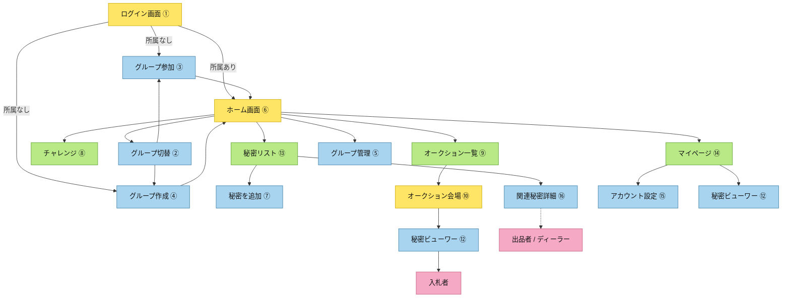

# 画面遷移図（確定分）

関連: [`画面.md`](./画面.md)

⑪ショップは含まない。

```mermaid
flowchart TB
  classDef yellow fill:#FFE566,stroke:#C9A600,color:#111
  classDef green fill:#B8E986,stroke:#5A9E2E,color:#111
  classDef blue fill:#A8D4F0,stroke:#3A7CA5,color:#111
  classDef pink fill:#F5A9C5,stroke:#C45A7A,color:#111

  L[ログイン画面 ①]:::yellow
  L -->|所属なし| J[グループ参加 ③]:::blue
  L -->|所属なし| N[グループ作成 ④]:::blue
  L -->|所属あり| H[ホーム画面 ⑥]:::yellow
  J --> H
  N --> H

  H --> S[秘密リスト ⑬]:::green
  H --> C[チャレンジ ⑧]:::green
  H --> A[オークション一覧 ⑨]:::green
  H --> M[マイページ ⑭]:::green

  S --> ADD[秘密を追加 ⑦]:::blue
  S --> REL[関連秘密詳細 ⑯]:::blue
  A --> VENUE[オークション会場 ⑩]:::yellow
  VENUE --> V1[秘密ビューワー ⑫]:::blue
  M --> SET[アカウント設定 ⑮]:::blue
  M --> V2[秘密ビューワー ⑫]:::blue

  H --> G0[グループ切替 ②]:::blue
  G0 --> J
  G0 --> N
  H --> G2[グループ管理 ⑤]:::blue

  R1[出品者 / ディーラー]:::pink
  R2[入札者]:::pink
  REL -.-> R1
  V1 --> R2
```
